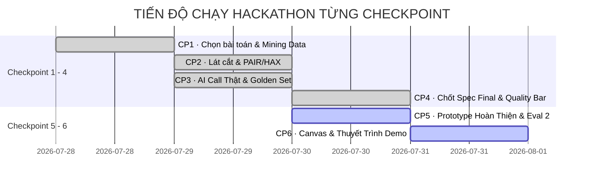

# BÁO CÁO NỔI BẬT: DANH SÁCH CÔNG VIỆC CỤ THỂ THEO TỪNG CHECKPOINT (CP1 → CP6)
**Dự án:** VLearn AI Flash Quiz & Tutor Chatbot  
**Nhóm:** C3-2QK (Zone 5) | **Hệ thống Bài học:** Khoá 3 AI Thực Chiến  

---

## 📌 BẢNG TỔNG HỢP MỐC CHECKPOINT (SUMMARY ROADMAP)

---

## 🎯 CHI TIẾT CÔNG VIỆC CỤ THỂ THEO TỪNG CHECKPOINT

### 1️⃣ CP1 · CHỌN BÀI TOÁN & MINING DATA (KHAI PHÁ BẰNG CHỨNG THỰC TẾ)
- **Mục tiêu**: Xác định đối tượng người dùng (Học viên VLearn), Job to be done (JTBD), nỗi đau thực tế (Illusion of Competence - Ảo tưởng hiểu bài) và đào xới bằng chứng từ dữ liệu chatlog thật.
- **Công việc cụ thể đã hoàn thành**:
  1. **Mining dữ liệu chatlog thật**: Phân tích tệp `data/vlearn-pack/chatlog/chat_history_anonymized_for_hackathon.csv` chứa 1.261 turn hỏi-đáp (2.522 tin nhắn).
  2. **Trích xuất số liệu đếm được (Evidence chuẩn B)**:
     - Nước đi kiểm tra hiểu bài `validate_understanding` chỉ xuất hiện **1/1.261 turn (0.08%)**.
     - Cờ `asked_check_question` chỉ có **3/2.515 tin nhắn (0.12%)**.
     - Có **142/585 hội thoại (24.3%)** bị kẹt kéo dài $\ge 3$ turns (kỷ lục kẹt 30 turns).
  3. **Thu thập 5 Quote nguyên văn**: Trích dẫn 5 câu nói gốc của học viên khi bị stuck.
  4. **Lập Bảng Impact lựa chọn 3 ứng viên**: So sánh Flash Quiz (CHỌN) vs AI Tutor Tóm Tắt (LOẠI) vs Nhắc nhở Discord (LOẠI).
- **Tệp sản phẩm (Deliverable)**: [spec.md (§1 & §2)](file:///c:/Users/Nitro%20Tiger/OneDrive/Dokumen/VInUni_AI/Lab/Hackathon/Batch03-K3-AI-Product-Hackathon/spec.md).

---

### 2️⃣ CP2 · LÁT CẮT MỘT CÂU & NGHIÊN CỨU NGUYÊN TẮC HAX / PAIR
- **Mục tiêu**: Định nghĩa Lát cắt MỘT CÂU dọc mỏng nhất, xác định mức Prototype, lựa chọn Automation vs Augmentation theo cost-of-error và nghiên cứu các sản phẩm tương tự.
- **Công việc cụ thể đã hoàn thành**:
  1. **Định nghĩa Lát cắt MỘT CÂU**: Học viên VLearn học xong slide $\rightarrow$ AI tự động sinh 3-20 câu Flash Quiz & hỗ trợ AI Tutor Chatbot trích dẫn đúng trang slide $\rightarrow$ Giúp xác nhận mức độ hiểu thật trong 1 phút.
  2. **Xác định Mức Prototype**: Chọn mức `[x] Mock / Working` (Giao diện React bấm trơn tru, lời gọi AI Gemini 2.5 Flash là THẬT 100%).
  3. **Quyết định Automation theo Cost-of-error**: Chọn `[x] Automate` vì chi phí sai lầm cực thấp (nếu câu hỏi chưa phù hợp, học viên chỉ bấm bỏ qua hoặc tạo lượt mới, không bị trừ điểm).
  4. **Nghiên cứu PAIR/HAX**: Áp dụng 4 nguyên tắc HAX (G1, G2, G8, G10).
- **Tệp sản phẩm (Deliverable)**: [spec.md (§3, §4, §6)](file:///c:/Users/Nitro%20Tiger/OneDrive/Dokumen/VInUni_AI/Lab/Hackathon/Batch03-K3-AI-Product-Hackathon/spec.md).

---

### 3️⃣ CP3 · LỜI GỌI AI THẬT ĐẦU TIÊN & BENCHMARK GOLDEN SET 20 CASES
- **Mục tiêu**: Tích hợp lời gọi API thật tại trung tâm quyết định, xây dựng bộ kiểm thử Golden Set $\ge 20$ cases bám sát 4 lớp chỗ khó (Taxonomy R3) và dữ liệu Chatlog thật (Rubric R4), chạy Eval lượt 1.
- **Công việc cụ thể đã hoàn thành**:
  1. **Xây dựng Lời gọi AI thật (`aiService.js`)**: Kết nối Google Gemini 2.5 Flash API bằng JSON Schema cấu trúc nguyên bản.
  2. **Xây dựng Golden Set 20 Test Cases (`golden_set.json`)**:
     - Đạt **10/20 cases (50%)** lấy trực tiếp từ file Chatlog VLearn thật (`data/vlearn-pack/chatlog/`).
     - Đạt **10/20 cases (50%)** lấy từ Khảo sát người dùng & Discord log.
     - Phân bổ đủ 4 lớp chỗ khó: ① Truth & Grounding (5 cases), ② Ambiguity (3 cases), ③ Out of Scope (3 cases), ④ Domain AI Engineering (5 cases) + 4 Rare Edge Cases.
  3. **Viết Script Kiểm thử Eval (`run_eval.py`)**: Tự động đo và xuất báo cáo Markdown [results_run1.md](file:///c:/Users/Nitro%20Tiger/OneDrive/Dokumen/VInUni_AI/Lab/Hackathon/Batch03-K3-AI-Product-Hackathon/eval/results_run1.md).
  4. **Kết quả đo Run 1**: Đạt **20/20 PASS = 100%** (Vượt mốc cam kết $\ge 80\%$).
- **Tệp sản phẩm (Deliverables)**:
  - [codebase/src/services/aiService.js](file:///c:/Users/Nitro%20Tiger/OneDrive/Dokumen/VInUni_AI/Lab/Hackathon/Batch03-K3-AI-Product-Hackathon/codebase/src/services/aiService.js)
  - [eval/golden_set.json](file:///c:/Users/Nitro%20Tiger/OneDrive/Dokumen/VInUni_AI/Lab/Hackathon/Batch03-K3-AI-Product-Hackathon/eval/golden_set.json)
  - [eval/run_eval.py](file:///c:/Users/Nitro%20Tiger/OneDrive/Dokumen/VInUni_AI/Lab/Hackathon/Batch03-K3-AI-Product-Hackathon/eval/run_eval.py)
  - [eval/results_run1.md](file:///c:/Users/Nitro%20Tiger/OneDrive/Dokumen/VInUni_AI/Lab/Hackathon/Batch03-K3-AI-Product-Hackathon/eval/results_run1.md)

---

### 4️⃣ CP4 · CHỐT TIẾN ĐỘ SPEC FINAL & CAM KẾT QUALITY BAR
- **Mục tiêu**: Chốt cứng `spec.md` trước hạn 23:59 N1, cam kết Quality Bar bằng con số cụ thể và đáp ứng đủ 5 ô nghiệm thu của Giám khảo & TA.
- **Công việc cụ thể đã hoàn thành**:
  1. **Chốt con số Quality Bar (§7 `spec.md`)**:
     - Pass Rate $\ge 80\%$ trên bộ Golden Set 20 cases.
     - 100% câu trả lời & quiz có trích dẫn đúng nguồn `[Slide Day X - Trang Y]`.
     - 0% câu hỏi bịa đặt thông tin ngoài slide (Zero Hallucination).
  2. **Đảm bảo 5 ô nghiệm thu**: Check đủ Evidence B, Bảng Impact, 4 Lớp Chỗ Khó, HAX/PAIR và Quality Bar.
  3. **Commit & Merge sang `main`**: Thực hiện push code lên branch `VuMinhQuang` và merge sạch vào `main`.
- **Tệp sản phẩm (Deliverable)**: [spec.md (Hoàn chỉnh)](file:///c:/Users/Nitro%20Tiger/OneDrive/Dokumen/VInUni_AI/Lab/Hackathon/Batch03-K3-AI-Product-Hackathon/spec.md).

---

### 5️⃣ CP5 · PROTOTYPE HOÀN THIỆN & NÂNG CẤP RETRIEVAL THÔNG MINH
- **Mục tiêu**: Xây dựng Web App React/Vite hoàn chỉnh, hỗ trợ Intent Detection, Metadata Range Retrieval, trượt Slide Viewer 60fps và kéo thả resizer panel.
- **Công việc cụ thể đã hoàn thành**:
  1. **Tự động đọc PDF Slide thật (`pdfService.js`)**: Parse trực tiếp các tệp PDF `d1-slide-hackathon.pdf` và `d2-slide-hackathon.pdf`.
  2. **Intent Detection & Metadata Range Retrieval (`ragService.js`)**:
     - Phân loại `QA` vs `SUMMARY` vs `QUIZ`.
     - Với `SUMMARY`: Lọc trực tiếp theo Metadata (Day 1, 1 Slide, Dãy Slide từ A đến B) lấy TOÀN BỘ slide mà KHÔNG bị cắt xén do Top-K Semantic Search.
  3. **Giao diện Modern & Interactive Slide Jump (`App.jsx` & `App.css`)**:
     - Thẻ Quiz và Tutor Chatbot hiển thị nút nguồn `📖 Nguồn: Slide X` / `📚 Sources`.
     - Click nút nguồn $\rightarrow$ Tự động đổi tệp bài giảng & cuộn `MainSlideViewer` chính xác 60fps đến đúng slide gốc.
     - Thanh phân chia `panel-resizer-bar` kéo thả điều chỉnh kích thước khung làm bài tùy ý.
  4. **Xử lý Biên & Guardrails Lỗi API**:
     - Chống hiển thị nguồn rác khi AI từ chối trả lời câu hỏi không liên quan.
     - Tự động hạ trạng thái `idle` và báo lỗi tiếng Việt khi gặp HTTP 429 API Limit / Quota Exhausted.
- **Tệp sản phẩm (Deliverables)**:
  - [codebase/src/App.jsx](file:///c:/Users/Nitro%20Tiger/OneDrive/Dokumen/VInUni_AI/Lab/Hackathon/Batch03-K3-AI-Product-Hackathon/codebase/src/App.jsx)
  - [codebase/src/services/ragService.js](file:///c:/Users/Nitro%20Tiger/OneDrive/Dokumen/VInUni_AI/Lab/Hackathon/Batch03-K3-AI-Product-Hackathon/codebase/src/services/ragService.js)
  - [walkthrough.md](file:///c:/Users/Nitro%20Tiger/.gemini/antigravity-ide/brain/ec138354-09b7-4414-a6e7-c78d1a6792e3/walkthrough.md)

---

### 6️⃣ CP6 · CANVAS & THUYẾT TRÌNH DEMO BẢO VỆ DỰ ÁN
- **Mục tiêu**: Hoàn thiện slide thuyết trình / Video Demo (1 câu Lát cắt, 1 demo sống, 1 bảng số liệu), hoàn thiện `canvas.md`, sẵn sàng phản biện đáp trả 4 lớp chỗ khó với Ban Giám Khảo.
- **Công việc cụ thể cần thực hiện**:
  1. **Hoàn thiện `canvas.md`**: Điền đầy đủ các khung Value Proposition Canvas / Lean Canvas cho sản phẩm.
  2. **Chuẩn bị Kịch bản Demo Sống (Live Demo Flow)**:
     - Mở ứng dụng VLearn $\rightarrow$ Đọc slide Day 1 $\rightarrow$ Bấm nút "Sinh 5 câu Quiz" $\rightarrow$ Chọn đáp án $\rightarrow$ Click nút trích dẫn nguồn trượt slide mượt 60fps.
     - Gõ Chatbot yêu cầu *"Tóm tắt Day 1 từ Slide 5 đến Slide 10"* $\rightarrow$ Cho thấy tính năng Intent Detection và Metadata Range Retrieval tổng hợp chính xác.
  3. **Chuẩn bị Slide Thuyết Trình (3 yếu tố cốt lõi)**:
     - *1 câu Lát cắt*: Học viên VLearn kiểm tra hiểu bài trong 1 phút bằng AI Flash Quiz & Tutor Chatbot bám sát slide PDF.
     - *1 Demo sống*: Trình diễn trực tiếp thao tác sinh Quiz & cuộn Slide mượt.
     - *1 Bảng số liệu*: Kết quả Benchmark Golden Set 20 cases đạt **100% PASS**.
  4. **Phản biện 4 lớp chỗ khó**: Sẵn sàng giải trình cách xử lý Hallucination, Ambiguity, Out-of-scope và Domain AI với Giám khảo.
- **Tệp sản phẩm (Deliverables)**:
  - [canvas.md](file:///c:/Users/Nitro%20Tiger/OneDrive/Dokumen/VInUni_AI/Lab/Hackathon/Batch03-K3-AI-Product-Hackathon/canvas.md)
  - Slide Thuyết Trình / Video Live Demo.
